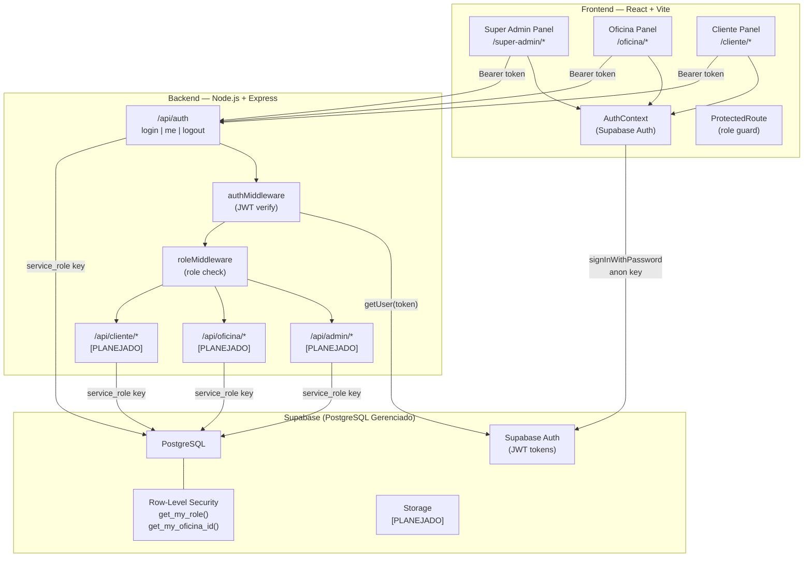

# Visão da Arquitetura — App SuaOficina

---

## Diagrama Geral



---

## Decisões de Design

### 1. Frontend direto no Supabase Auth (dual-path)

O frontend autentica diretamente via Supabase Auth (`signInWithPassword`) e armazena a sessão/token localmente. Para rotas protegidas do backend, o token JWT é enviado no header `Authorization: Bearer <token>`. O backend valida o token com `supabaseAdmin.auth.getUser(token)`.

**Por que:** Simplifica o fluxo de autenticação, permite persistência de sessão automática do Supabase, e o backend autoriza independentemente com o mesmo token.

### 2. Dois clients Supabase no backend

- `supabaseAdmin` — com `service_role_key` para operações administrativas (bypass RLS)
- `supabaseAnon` — com `anon_key` para operações com contexto do usuário

**Por que:** O `service_role` permite CRUD irrestrito (necessário para seed, fix scripts, e operações admin). O `anon_key` permite testar a perspectiva do usuário.

### 3. RLS com SECURITY DEFINER functions

As funções `get_my_role()` e `get_my_oficina_id()` são `SECURITY DEFINER`, consultando `profiles` diretamente sem passar pela RLS. As policies então chamam essas funções.

**Por que:** Evita recursão infinita. Sem `SECURITY DEFINER`, uma policy em `profiles` que consulta `profiles` causa loop.

### 4. CSS Design System monolítico

Todo o CSS está em um único arquivo `index.css` com CSS variables, sem frameworks CSS.

**Por que:** Controle total sobre o design, sem dependências externas, performance superior (sem overhead de framework CSS), e o projeto é pequeno o suficiente para manter tudo em um arquivo.

### 5. Layouts por perfil no App.jsx

Cada perfil (Super Admin, Oficina) tem seu componente de layout que define menu items e renderiza `<Routes>` internas.

**Por que:** Isolamento visual e navegacional entre perfis. Facilita adicionar rotas específicas por perfil sem poluir o roteamento global.

---

## Integrações e Dependências Externas

| Serviço | Uso | Tipo |
|---|---|---|
| **Supabase** | Banco de dados, autenticação, storage (futuro) | BaaS |
| **Google Fonts (Inter)** | Tipografia do design system | CDN |

### Dependências Backend

| Pacote | Uso |
|---|---|
| `express` | Framework HTTP |
| `@supabase/supabase-js` | Client Supabase |
| `cors` | CORS middleware |
| `dotenv` | Variáveis de ambiente |
| `pg` | PostgreSQL client direto (scripts) |
| `bcryptjs` | Hashing (instalado, ainda não usado) |
| `jsonwebtoken` | JWT (instalado, ainda não usado — auth via Supabase) |

### Dependências Frontend

| Pacote | Uso |
|---|---|
| `react` + `react-dom` | Framework UI |
| `react-router-dom` | Roteamento SPA |
| `@supabase/supabase-js` | Client Supabase Auth |
| `vite` + `@vitejs/plugin-react` | Build + dev server |

---

## Variáveis de Ambiente

### Backend (`.env`)

```
SUPABASE_URL=https://<project>.supabase.co
SUPABASE_ANON_KEY=<anon_key>
SUPABASE_SERVICE_ROLE_KEY=<service_role_key>
FRONTEND_URL=http://localhost:5173
PORT=3001
```

### Frontend (`.env`)

```
VITE_SUPABASE_URL=https://<project>.supabase.co
VITE_SUPABASE_PUBLISHABLE_DEFAULT_KEY=<anon_key>
```
